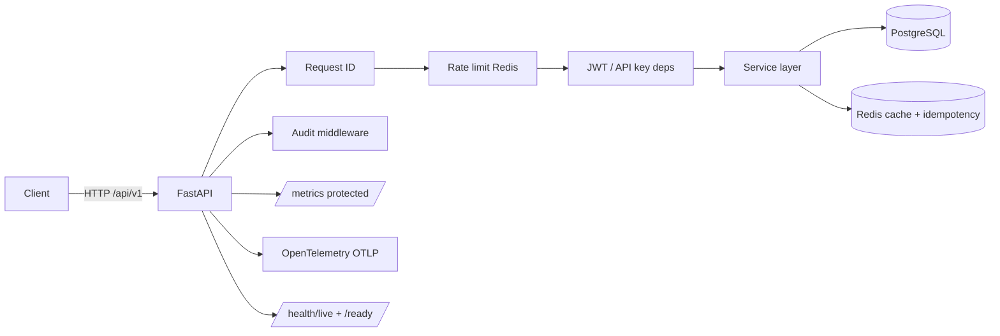

# Python Service Template

[](https://github.com/GavrilovEgorOf/python-service-template/actions/workflows/ci.yml)
[](LICENSE)
[](https://github.com/GavrilovEgorOf/python-service-template/releases)

Production-ready **FastAPI microservice golden path** for senior backend / platform portfolios: JWT auth, Redis idempotency (SET NX), rate limiting, audit logging, hardened production settings, Helm chart, and split CI.

## Architecture



## Security & production features (v0.5)

| Feature | Implementation |
|---------|----------------|
| **JWT auth** | PyJWT with iss/aud/exp validation |
| **API key auth** | `X-API-Key` header |
| **Prod guardrails** | Pydantic validator blocks insecure prod config |
| **Idempotency** | Redis `SET NX` + in_progress/completed states |
| **Rate limiting** | Redis sliding window on `/api/v1/items` |
| **Metrics auth** | `/metrics` requires `X-Metrics-Key` or API key |
| **Audit log** | structlog + optional DB persistence |
| **Docs in prod** | Swagger disabled unless `DEBUG=true` |
| **Helm chart** | `deploy/helm/python-service-template/` |

## Quick start

```bash
git clone https://github.com/GavrilovEgorOf/python-service-template.git my-service
cd my-service
python scripts/rename_service.py my-service

python -m venv .venv && source .venv/bin/activate
pip install -e ".[dev]"
cp .env.example .env

docker compose up -d postgres redis
alembic upgrade head
uvicorn app.main:app --reload
```

Generate a JWT for local testing:

```python
from app.core.security import create_access_token
print(create_access_token("user-1"))
```

## API examples

```bash
# API key
curl -H "X-API-Key: dev-api-key-change-me" http://localhost:8000/api/v1/items

# JWT
curl -H "Authorization: Bearer <token>" http://localhost:8000/api/v1/items

# Idempotent create
curl -X POST http://localhost:8000/api/v1/items \
  -H "Content-Type: application/json" \
  -H "Idempotency-Key: order-123" \
  -d '{"name":"alpha"}'

# Metrics (requires key)
curl -H "X-Metrics-Key: dev-api-key-change-me" http://localhost:8000/metrics
```

## Testing

```bash
pytest tests/unit --cov=app          # fast: SQLite + FakeRedis
pytest tests/integration -m integration  # Postgres + Redis + Alembic
pre-commit run --all-files
```

## Production deploy (Helm)

See [deploy/helm/python-service-template/PRODUCTION.md](deploy/helm/python-service-template/PRODUCTION.md).

```bash
helm upgrade --install api ./deploy/helm/python-service-template \
  -f deploy/helm/python-service-template/values-prod.yaml
```

## Documentation

- [CONTRIBUTING.md](CONTRIBUTING.md)
- [docs/CUSTOMIZE.md](docs/CUSTOMIZE.md)
- [ADR 0001 — Project structure](docs/adr/0001-project-structure.md)
- [ADR 0002 — API versioning & observability](docs/adr/0002-api-versioning-and-observability.md)
- [ADR 0003 — Security & production hardening](docs/adr/0003-security-production-hardening.md)

## License

MIT — see [LICENSE](LICENSE).
