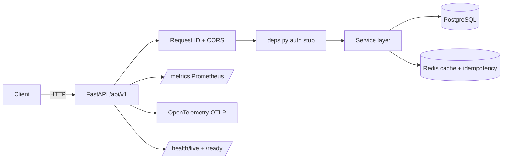

# Python Service Template

[](https://github.com/GavrilovEgorOf/python-service-template/actions/workflows/ci.yml)
[](LICENSE)
[](https://github.com/GavrilovEgorOf/python-service-template/releases)

Production-ready **FastAPI microservice golden path** for teams and senior backend portfolios: async PostgreSQL, Redis caching, idempotency, auth hooks, observability, split CI, and Docker.

## Architecture



## Why this template

| Problem | Golden path answer |
|---------|-------------------|
| Every service starts from scratch | Clone, rename, ship |
| Missing prod hygiene | Global exceptions, request ID, readiness split |
| ML/backend teams need standards | Layered layout + ADR + CONTRIBUTING |
| CI without real infra | Unit (SQLite + FakeRedis) + integration (Postgres + Redis) |

## Stack

- **FastAPI** + **Uvicorn** + **API versioning** (`/api/v1`)
- **SQLAlchemy 2 async** + **Alembic** + **PostgreSQL**
- **Redis** — cache, idempotency keys, readiness probe
- **Auth stub** — Bearer JWT placeholder + `X-API-Key`
- **Observability** — structlog, Prometheus `/metrics`, OpenTelemetry
- **Quality** — ruff, mypy, bandit, pip-audit, pre-commit, pytest

## Quick start

```bash
git clone https://github.com/GavrilovEgorOf/python-service-template.git my-service
cd my-service
python scripts/rename_service.py my-service

python -m venv .venv
source .venv/bin/activate  # Windows: .venv\Scripts\activate
pip install -e ".[dev]"

cp .env.example .env
docker compose up -d postgres redis
alembic upgrade head
uvicorn app.main:app --reload
```

Endpoints:

| URL | Purpose |
|-----|---------|
| http://localhost:8000/docs | Swagger UI |
| http://localhost:8000/api/v1/items | Sample CRUD API |
| http://localhost:8000/api/v1/health/ready | Readiness (DB + Redis) |
| http://localhost:8000/health/live | K8s liveness alias |
| http://localhost:8000/metrics | Prometheus metrics |

## Features (v0.4)

- **Pagination** — `GET /api/v1/items?limit=20&offset=0&sort=-created_at`
- **Idempotency** — `Idempotency-Key` header on `POST /api/v1/items`
- **Redis cache** — `GET /api/v1/items/{id}` with TTL
- **Auth** — disable via `AUTH_DISABLED=true` or use `X-API-Key` / Bearer stub
- **Request tracing** — `X-Request-ID` propagated to logs and error payloads

## Project layout

```
app/
├── api/
│   ├── deps.py              # auth dependencies
│   ├── exceptions.py        # global error handlers
│   ├── middleware/          # request ID
│   └── routes/v1/           # versioned routes
├── core/                    # config, logging, redis, metrics, lifespan
├── domain/                  # domain errors + user context
├── services/                # business logic + idempotency
├── db/                      # SQLAlchemy models/session
└── schemas/                 # Pydantic DTOs
tests/
├── unit/                    # fast: SQLite + FakeRedis
└── integration/             # Postgres + Redis (CI services)
docs/adr/                    # architecture decisions
```

## Development

```bash
# Unit tests (default, no Docker)
pytest tests/unit --cov=app

# Integration tests (Docker or CI services)
pytest tests/integration -m integration

# Lint & types
ruff check app tests && ruff format app tests
mypy app
pre-commit run --all-files
```

## Docker (multi-stage, non-root)

```bash
docker compose up --build
```

Production image runs as `appuser` with `HEALTHCHECK` on `/health/live`.

## Customize

See [docs/CUSTOMIZE.md](docs/CUSTOMIZE.md) and [CONTRIBUTING.md](CONTRIBUTING.md).

## ADRs

- [0001 — Project structure](docs/adr/0001-project-structure.md)
- [0002 — API versioning & observability](docs/adr/0002-api-versioning-and-observability.md)

## License

MIT — see [LICENSE](LICENSE).
